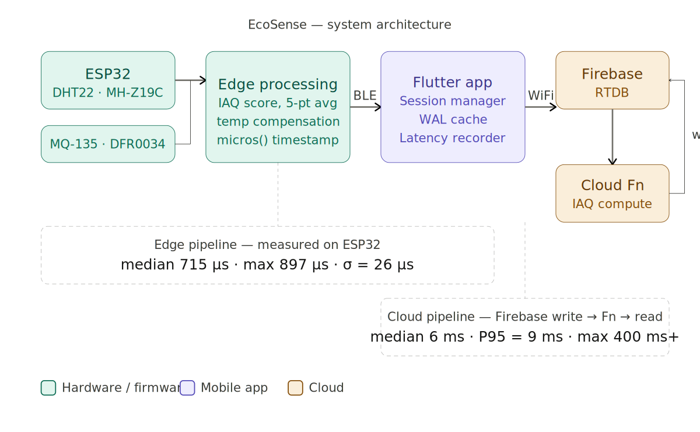
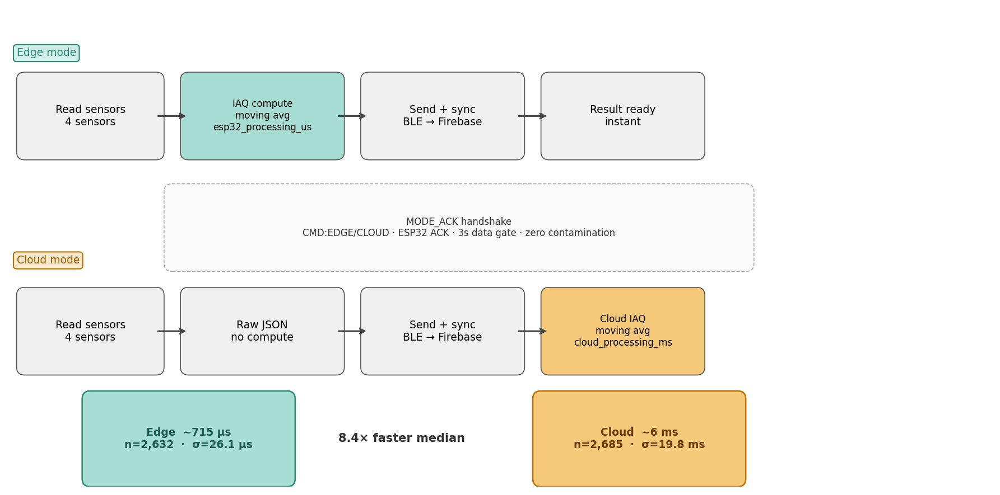
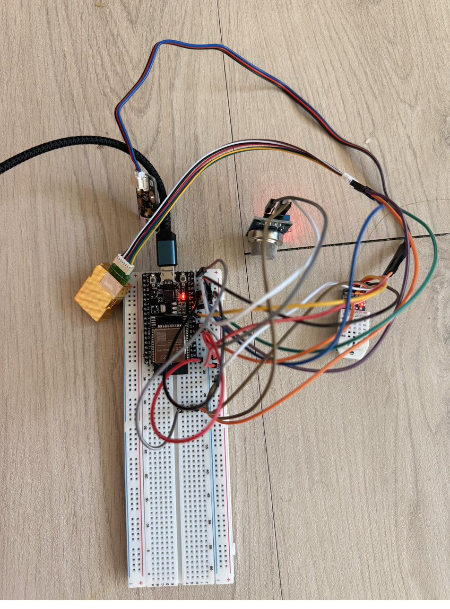
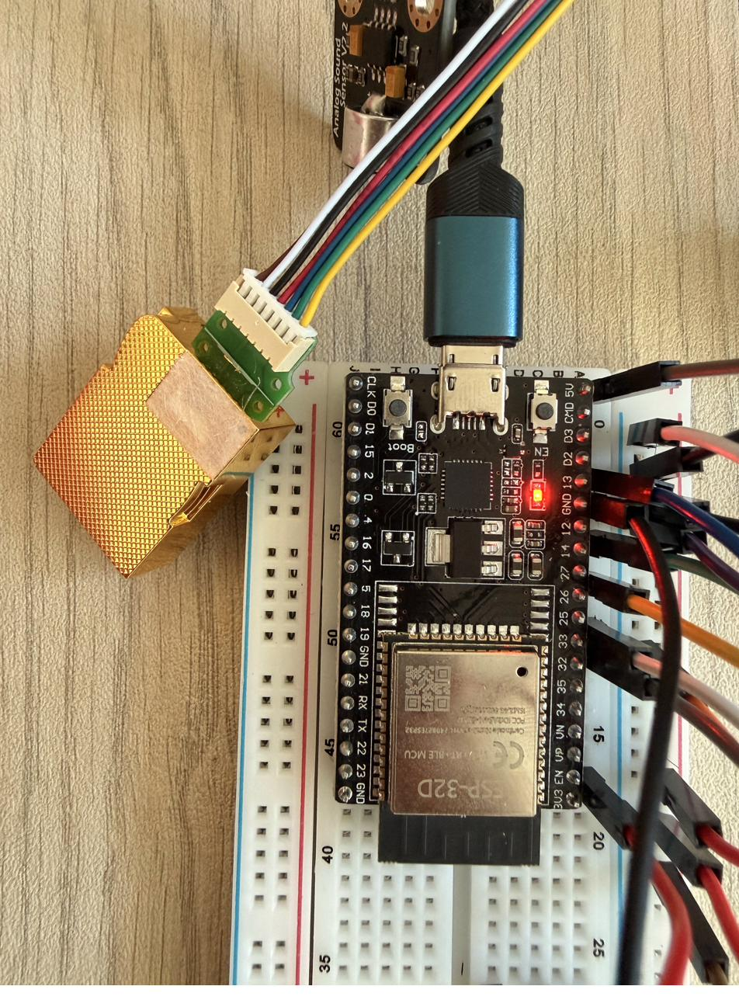
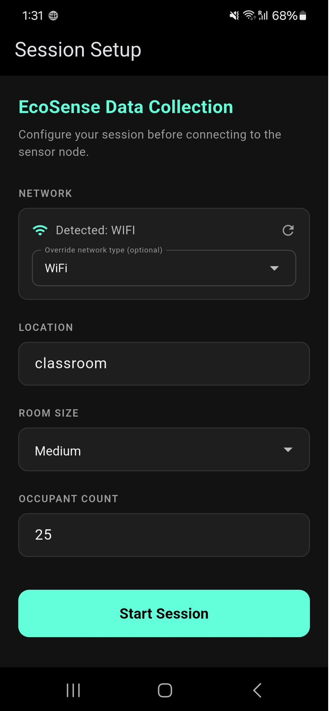
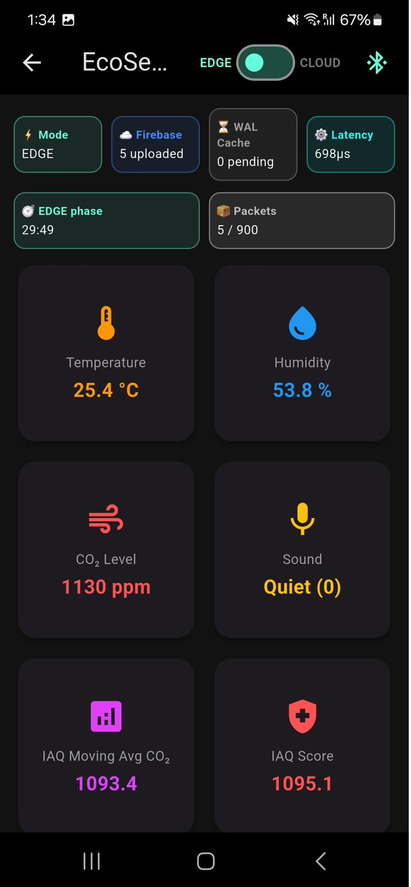
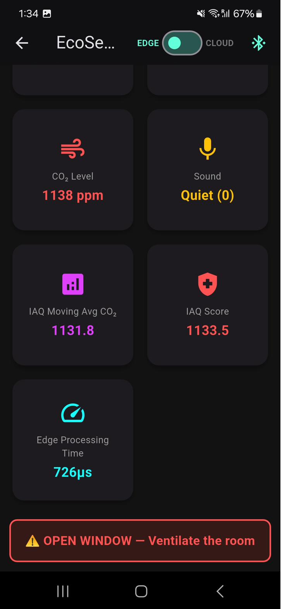
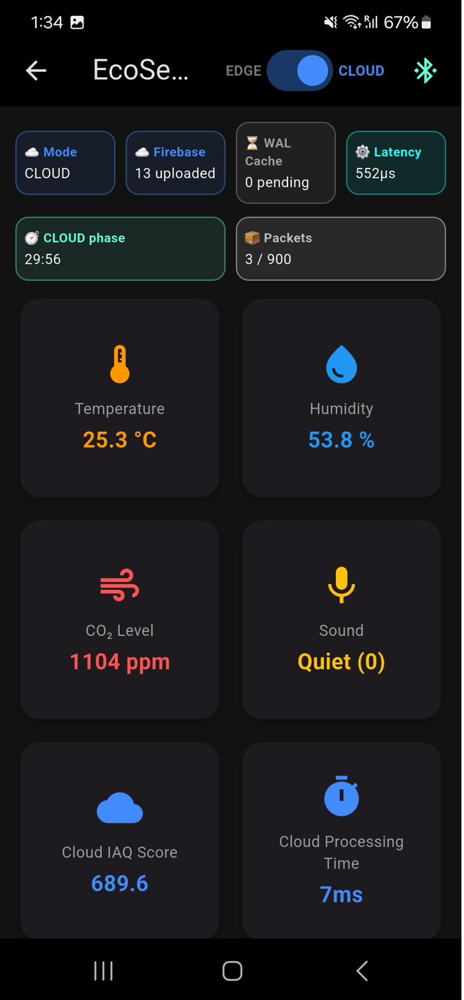

# EcoSense: Edge vs. Cloud IAQ Monitoring

> Real-time Indoor Air Quality monitoring system comparing edge vs. cloud pipeline latency across university campus environments.

[](paper/ecosense_paper.tex)
[](https://doi.org/10.5281/zenodo.19563976)
[](LICENSE)
[](firmware/ecosense_final/)
[](kdu_monitor/)

---

<details>
<summary><strong>Abstract</strong></summary>

CO2 concentrations in university classrooms routinely exceed thresholds associated with reduced cognitive performance, yet most institutional monitoring systems rely on cloud-dependent pipelines that assume reliable internet connectivity. This paper presents EcoSense, a deployed IAQ monitoring system built on an ESP32 WROOM-32D V4 with CO2, temperature, humidity, air quality, and sound sensors, connected via BLE to an Android application writing opportunistically to Firebase Realtime Database. Using a balanced A/B methodology across three real deployment locations in Sokcho, South Korea, we collected 5,317 readings and compared edge vs. cloud pipeline latency. Edge processing achieved a median of 715 μs (max 897 μs, 100% below 1 ms). Cloud pipeline: median 6 ms, P95 9 ms, max >400 ms. Mann-Whitney U=0, p≈0, Cliff's δ=1.0 — complete stochastic separation across all 5,317 measurements.

</details>

---

## Key Results

| Metric | Edge (ESP32) | Cloud (Firebase Fn) |
|--------|-------------|---------------------|
| Median latency | 715 μs | 6 ms |
| Max latency | 897 μs | >400 ms |
| P95 | <1 ms | 9 ms |
| Std deviation | 26.1 μs | 19.8 ms |
| n (readings) | 2,632 | 2,685 |
| Mann-Whitney U | 0 | — |
| Cliff's δ | 1.0 (large) | — |

**Maximum edge latency (897 μs) < Minimum cloud latency (1 ms) — complete stochastic separation with zero overlap.**

---

## System Architecture



*Full EcoSense pipeline: ESP32 → BLE → Flutter → Firebase → Cloud Function*

---

## A/B Methodology



*Balanced A/B data collection: 30-min edge phase → 30-min cloud phase, separated by BLE MODE_ACK handshake*

---

## Hardware

<table>
<tr>
<td></td>
<td></td>
</tr>
<tr>
<td align="center">Full setup</td>
<td align="center">Sensor closeup</td>
</tr>
</table>

**Components:**
- ESP32 WROOM-32D V4 on MB-102 breadboard
- MH-Z19C CO2 sensor (UART, GPIO14/13)
- DHT22 temperature + humidity (GPIO26)
- MQ-135 air quality analog (GPIO32)
- DFR0034 sound level analog (GPIO33)
- Power: wall charger (500mA combined draw)

---

## Mobile Application

<table>
<tr>
<td></td>
<td></td>
<td></td>
<td></td>
</tr>
<tr>
<td align="center">Session Setup</td>
<td align="center">Edge Mode (698μs)</td>
<td align="center">OPEN WINDOW Alert</td>
<td align="center">Cloud Mode (7ms)</td>
</tr>
</table>

---

## Dataset

The complete dataset of 5,317 records is publicly available on Zenodo:

**[DOI: 10.5281/zenodo.19563976](https://doi.org/10.5281/zenodo.19563976)**

| Column | Description |
|--------|-------------|
| esp32_processing_us | Edge latency in microseconds |
| cloud_processing_ms | Cloud latency in milliseconds |
| mode | `edge` or `cloud` |
| session_location | MyRoom, Classroom1402, ClassLab1404 |
| co2 | CO2 in ppm (MH-Z19C) |
| temp | Temperature °C (DHT22) |
| hum | Humidity % (DHT22) |
| air | Air quality analog (MQ-135) |
| sound | Sound level analog (DFR0034) |
| iaq_score | Computed IAQ score (alert threshold: 1000) |
| cloud_iaq_score | Same computation run on Cloud Function |
| gateway_receive_time | Unix timestamp of BLE receipt on phone |

---

## Deployment Locations

| Location | Type | Room Size | Occupants | Network |
|----------|------|-----------|-----------|---------|
| MyRoom | Off-campus apartment, Sokcho | Small | 1 | Residential hotspot |
| Classroom 1402 | KDU Global lecture room | Medium | 25 | Campus hotspot |
| Classlab 1404 | KDU Global computer lab | Medium | ~5 | Campus hotspot |

---

## Replication / Getting Started

### ESP32 Firmware

**Arduino IDE settings:**

```
Board:           ESP32 Dev Module
Partition:       Huge APP
Flash mode:      DIO
Flash frequency: 40MHz
Upload:          Hold BOOT button during upload
```

**Libraries required:**
- ArduinoJson
- Adafruit DHT sensor library
- ESP32 BLE Arduino (built-in)
- MHZ19 library

**BLE UUIDs:**
```
Device name:  EcoSense_Node_1
Service UUID: 4fafc201-1fb5-459e-8fcc-c5c9c331914b
Notify UUID:  beb5483e-36e1-4688-b7f5-ea07361b26a8
Write UUID:   beb5483e-36e1-4688-b7f5-ea07361b26a9
```

> **Known hardware pitfall:** Do NOT use GPIO12 for any sensor — it is a strapping pin that prevents boot when pulled HIGH.

Firmware source: [`firmware/ecosense_final/ecosense_final.ino`](firmware/ecosense_final/ecosense_final.ino)

### Flutter App

**Prerequisites:**
- Flutter SDK
- Firebase project (Blaze plan required for Cloud Functions)
- Android device with BLE support

**Setup:**
1. Run `flutterfire configure` in `/kdu_monitor/`
2. Enable Firebase Realtime Database
3. Deploy Cloud Function from `/functions/`
4. Connect via BLE to `EcoSense_Node_1`

App source: [`kdu_monitor/`](kdu_monitor/)

---

## Citation

```bibtex
@misc{gyawali2026ecosense,
  author      = {Gyawali Aabhushan},
  title       = {EcoSense: Edge vs. Cloud Computation Placement for
                 Real-Time IAQ Monitoring in University Campus Environments},
  year        = {2026},
  institution = {Kyungdong University Global},
  note        = {Preprint}
}

@dataset{gyawali2026dataset,
  author    = {Gyawali Aabhushan},
  title     = {EcoSense IAQ Monitoring Dataset: Edge vs. Cloud Pipeline
               Latency Across Three Campus Locations},
  year      = {2026},
  publisher = {Zenodo},
  doi       = {10.5281/zenodo.19563976},
  url       = {https://doi.org/10.5281/zenodo.19563976}
}
```

---

## Acknowledgements

This project was conducted under the KDU Global Graduate-Undergraduate Research Program (GURP), Spring 2026, supervised by Professor Mohammed A.A., Department of Smart Computing, Kyungdong University Global.
