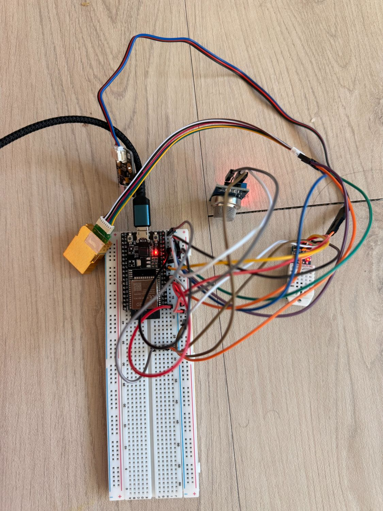
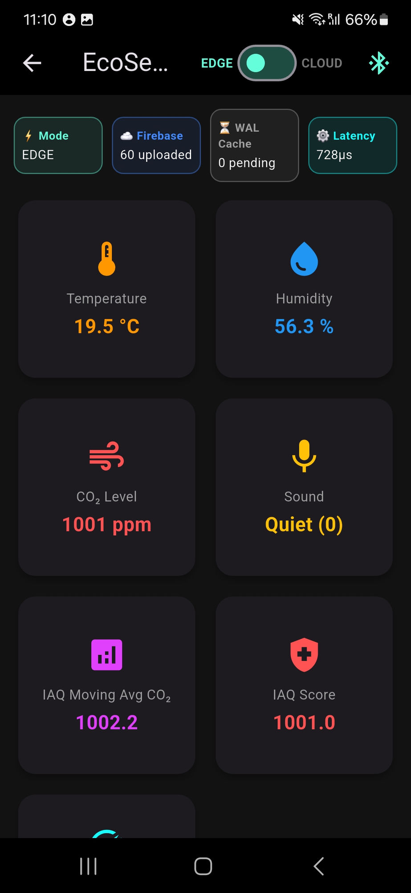
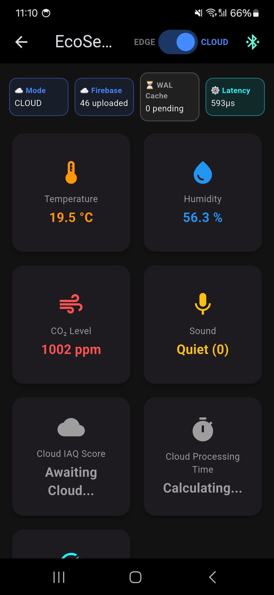
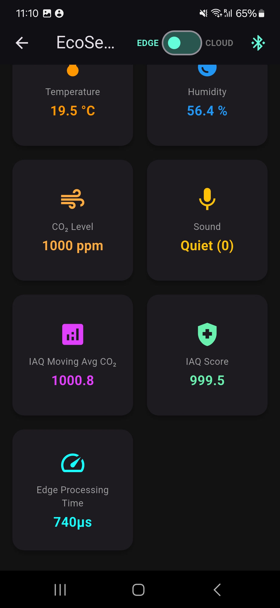
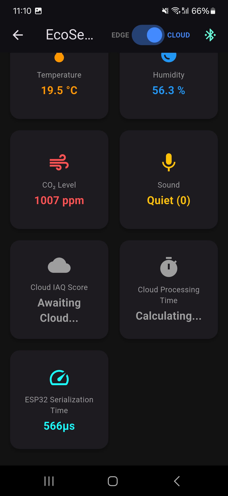

# EcoSense — KDU Campus Monitor

> Real-time Indoor Air Quality monitoring system with Edge vs Cloud computation latency analysis. Built for KDU Global university campus environments.

## 🔬 Research

**Title:** EcoSense: Edge vs. Cloud Computation Placement for Real-Time IAQ Monitoring in University Campus Environments — A Pipeline Latency Analysis

**Research Question:** Does local edge processing produce lower end-to-end pipeline latency than cloud offloading for real-time IAQ monitoring under real-world campus network conditions?

**Key Findings (Preliminary):**
- Edge processing: ~728–740 μs (ESP32 computation + serialization)
- Cloud processing: ~11 ms (Firebase Cloud Function)
- ESP32 serialization only (cloud mode): ~566 μs
- Serialization dominates over computation (~160 μs delta)

## 🏗️ Architecture

```
ESP32 (sensors)
↓ BLE
Flutter App (gateway)
↓ WiFi
Firebase RTDB
↓ trigger
Cloud Function (IAQ calculation)
↓ write-back
Flutter App (display)
```

**Edge Mode:** ESP32 calculates IAQ score → sends heavy JSON → Flutter displays immediately

**Cloud Mode:** ESP32 sends raw data → Flutter pushes to Firebase → Cloud Function calculates → writes back → Flutter updates

## 🛠️ Hardware

| Sensor | Parameter | GPIO | Status |
|--------|-----------|------|--------|
| DHT22 | Temperature + Humidity | GPIO26 | ✅ Working |
| MH-Z19C | CO₂ (NDIR) | TX=GPIO14, RX=GPIO13 | ✅ Working |
| MQ-135 | Air Quality (VOC indicator) | GPIO32 | ✅ Working |
| DFR0034 | Sound (occupancy proxy) | GPIO33 | ✅ Working |

**Board:** ESP32 WROOM-32D V4 on MB-102 breadboard
**Flash settings:** Huge APP partition, DIO mode, 40 MHz

## 📱 Screenshots

<div align="center">



*Hardware setup — ESP32 WROOM-32D on MB-102 breadboard with all four sensors*

---



*Edge mode dashboard — full pipeline active. Latency badge shows **728 μs** end-to-end.*

---



*Cloud mode dashboard — 46 records uploaded to Firebase RTDB. Latency badge: **593 μs** (BLE receive → Firebase push, excluding Cloud Function round-trip).*

---



*Edge mode — IAQ Moving Avg CO₂: 1000.8 ppm, IAQ Score: 999.5, Edge Processing Time: **740 μs***

---



*Cloud mode — ESP32 Serialization Time: **566 μs** (no IAQ computation on device). Cloud Function result pending.*

</div>

## 📊 Data Pipeline

Every packet logged to Firebase contains:

**From ESP32:**
- `node_id`, `packet_count`, `node_tick_ms`, `mode`
- `temp`, `hum`, `co2`, `air`, `sound`
- `sensor_status` (per sensor OK/ERROR)
- `esp32_processing_us` (computational penalty measurement)
- Edge mode only: `iaq_moving_avg`, `iaq_score`, `alert`, `buffer_ready`

**Added by Flutter gateway:**
- `gateway_receive_time` (ms epoch, captured first — before any parsing)
- `cloud_sync_time` (Firebase ServerValue.timestamp)
- `session_location`, `network_type`, `time_of_day`

**Written back by Cloud Function (cloud mode only):**
- `cloud_iaq_score`, `cloud_iaq_moving_avg`, `cloud_alert`
- `cloud_processing_ms`, `function_completed_at`

## 🧪 Methodology

**A/B Test:** MODE_ACK handshake prevents dataset contamination during mode switching. App drops all packets for 3 seconds or until ESP32 acknowledges mode change.

**Timing:** `esp32_processing_us` wraps the entire payload build including `serializeJson()` — measures true computational penalty of edge vs. cloud path.

**Offline resilience:** SQLite WAL caches failed Firebase pushes, flushes on reconnect.

## 📁 Project Structure

```
kdu-campus-monitor/
├── firmware/
│   └── ecosense_final/
│       └── ecosense_final.ino
├── kdu_monitor/          ← Flutter app
│   └── lib/
│       └── main.dart
├── functions/            ← Firebase Cloud Function
│   ├── index.js
│   └── package.json
├── docs/
│   └── images/           ← screenshots
└── README.md
```

## 🚀 Setup

### ESP32 Firmware
1. Open `firmware/ecosense_final/ecosense_final.ino` in Arduino IDE
2. Board: ESP32 Dev Module
3. Partition: Huge APP (3 MB No OTA / 1 MB SPIFFS)
4. Flash Mode: DIO, Frequency: 40 MHz
5. Hold BOOT button when "Connecting..." appears

### Flutter App
```bash
cd kdu_monitor
flutter pub get
flutter run
```
> Note: Requires `google-services.json` (not included — configure your own Firebase project)

### Cloud Function
```bash
firebase deploy --only functions
```
> Note: Requires Firebase Blaze plan

## ⚠️ Limitations

- Single ESP32 node (one location at a time)
- MH-Z19C requires 60 s warmup after power-on
- MQ-135 uncalibrated — raw analog indicator only
- DHT22 ±0.5 °C accuracy propagates into IAQ score
- Dataset small-scale — single university campus

## 📋 Progress

- [x] Hardware wiring and sensor testing
- [x] Combined firmware with NVS fix
- [x] BLE GATT server with Edge/Cloud modes
- [x] Flutter BLE dashboard app
- [x] Firebase sync with WAL resilience
- [x] Firebase Cloud Function (IAQ calculation)
- [x] End-to-end pipeline confirmed working
- [ ] Formal data collection (in progress)
- [ ] Research paper writing
- [ ] TechRxiv/arXiv preprint submission

## 👤 Author

Gyawali Aabhushan | Student ID: 2217133
Smart Computing F22 | KDU Global, Sokcho, South Korea
GURP Supervisor: Prof. Mohammed A.A

---

*Solo project — all hardware, firmware, app, and research by one student.*

---

## 🔒 Security Note for Contributors

This repository does not include API keys or Firebase credentials.
You must provide your own `google-services.json` and configure your own Firebase project.
