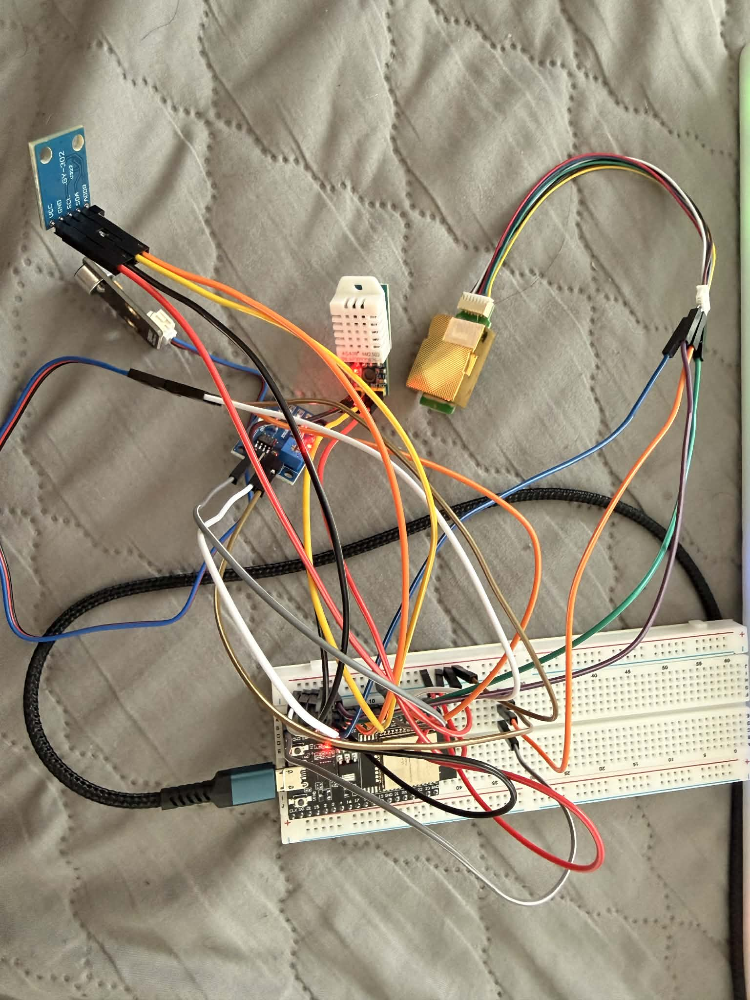
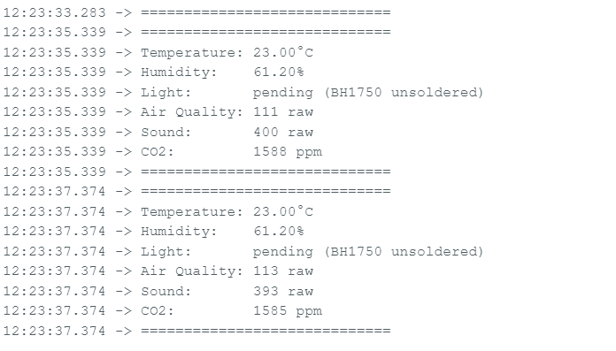

# KDU Campus Monitor


Real-time indoor environmental quality monitoring system for KDU Global university classrooms. An ESP32 reads five environmental sensors and broadcasts live data to an Android app over BLE.

---

## Hardware

| Sensor | Parameter | Interface | GPIO | Status |
|--------|-----------|-----------|------|--------|
| DHT22 | Temperature + Humidity | Digital | GPIO26 | ✅ Working |
| MQ-135 | Air Quality (VOC / CO) | ADC | GPIO32 | ✅ Working |
| DFR0034 | Sound Level | ADC | GPIO33 | ✅ Working |
| MH-Z19C | CO₂ (NDIR) | UART | TX:14 / RX:12 | ✅ Working |
| BH1750 | Light Intensity | I2C | SDA:27 / SCL:25 | ⏳ Pending (solder fix) |

**Microcontroller:** ESP32 WROOM-32D V4
**Power:** USB (5V via USB-C)

---

## Architecture

```
┌────────────────────┐       BLE GATT        ┌──────────────────────┐
│   ESP32 WROOM-32D  │ ─────────────────────▶│   Flutter Android App │
│                    │   Notify every 2s      │   (flutter_blue_plus) │
│  DHT22   MQ-135    │   JSON payload         └──────────┬───────────┘
│  DFR0034 MH-Z19C   │                                   │
│  BH1750 (pending)  │                          (future) │
└────────────────────┘                                   ▼
                                               ┌──────────────────────┐
                                               │   Firebase Realtime   │
                                               │   Database / Hosting  │
                                               └──────────────────────┘
```

---

## BLE Configuration

| Field | Value |
|-------|-------|
| Device name | `KDU-Monitor` |
| Service UUID | `4fafc201-1fb5-459e-8fcc-c5c9c331914b` |
| Characteristic UUID | `beb5483e-36e1-4688-b7f5-ea07361b26a8` |
| Payload format | JSON string, notify every 2 seconds |

**Example payload:**
```json
{"temp":23.00,"humidity":61.20,"air":111,"sound":400,"co2":1588,"light":null}
```

---

## Progress

- [x] Hardware wiring and sensor testing
- [x] Combined firmware (all sensors reading, Serial output)
- [x] BLE GATT server firmware
- [x] Flutter BLE dashboard app (code written)
- [ ] Flutter app tested on Android device
- [ ] BH1750 soldering fix
- [ ] Firebase sync
- [ ] Benchmark logic (edge vs cloud latency)
- [ ] Research paper (EcoSense — targeting TechRxiv)

---

## Hardware Setup



---

## Serial Monitor Output



---

## Repo Structure

```
kdu-campus-monitor/
├── firmware/
│   ├── combined_sensor/
│   │   └── combined_sensor.ino   # all sensors, Serial JSON output
│   └── ble_gatt_server/
│       └── ble_gatt_server.ino   # BLE GATT server, notifies Flutter app
├── flutter_app/
│   └── lib/
│       └── main.dart             # ScanPage + DashboardPage
├── docs/
│   ├── hardware_setup.jpg
│   └── serial_monitor.png
└── README.md
```

---

## Built With

- [Arduino / ESP32 Arduino Core](https://github.com/espressif/arduino-esp32)
- [DHT sensor library (Adafruit)](https://github.com/adafruit/DHT-sensor-library)
- [MHZ19 library](https://github.com/strange-v/MHZ19)
- [Flutter](https://flutter.dev)
- [flutter_blue_plus](https://pub.dev/packages/flutter_blue_plus)

---

*Solo project — Gyawali Aabhushan, KDU Global, Smart Computing F22*
