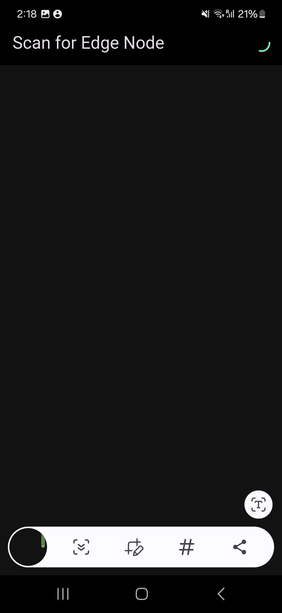
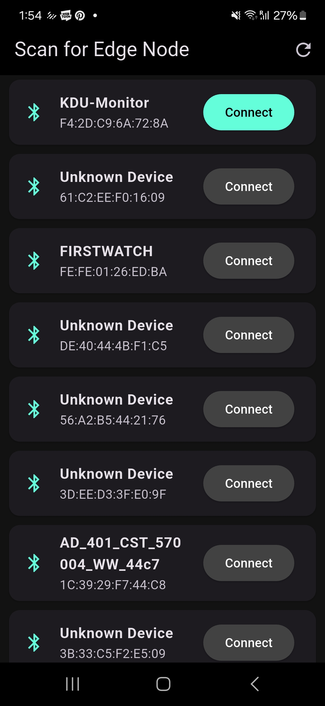
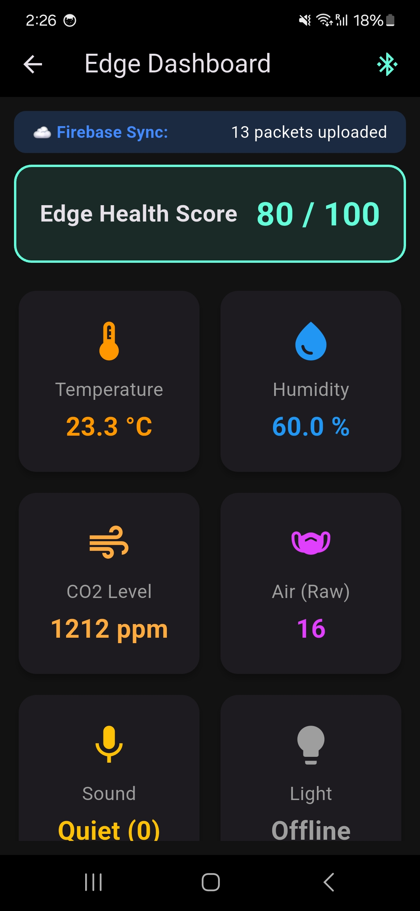
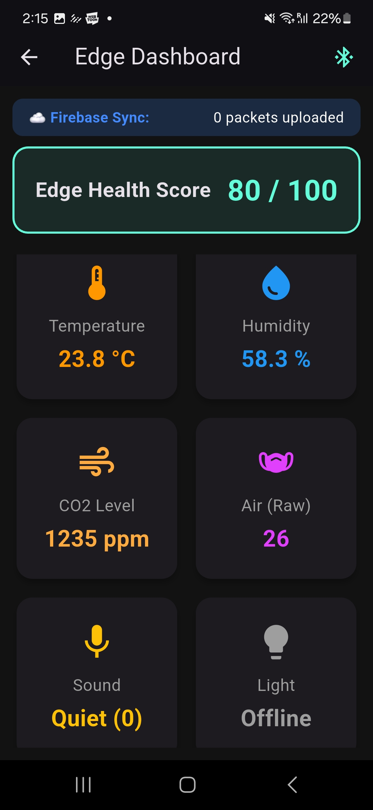
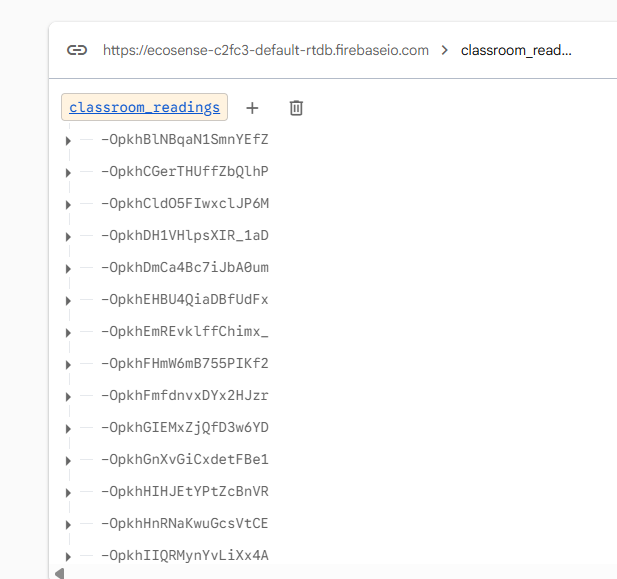
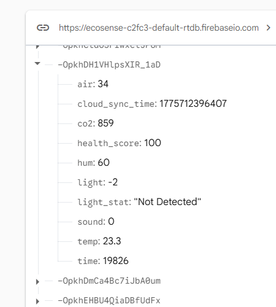

# KDU Campus Monitor


> **IoT Edge-to-Cloud Environmental Monitoring System**
> 
> Real-time indoor environmental quality monitoring system for KDU Global university classrooms. An ESP32 edge node reads five environmental sensors, broadcasts live data to an Android app over BLE (Bluetooth Low Energy), and syncs all readings to Firebase Realtime Database for cloud-side analysis and logging. Built as part of the **EcoSense** GURP (Graduate Undergraduate Research Programme) project.

---

## Project Status: 95% Complete ✅

The full edge-to-cloud data pipeline is operational. The ESP32 firmware streams a JSON sensor payload every 2 seconds via BLE GATT. The Flutter Android application scans, connects, parses the payload, renders a live dashboard, and uploads every reading to Firebase Realtime Database. The system has been validated end-to-end on physical hardware.

| Component | Status |
|-----------|--------|
| ESP32 BLE GATT firmware | ✅ Operational |
| Flutter BLE scanner & dashboard | ✅ Operational |
| Firebase Realtime Database sync | ✅ Operational |
| BH1750 light sensor integration | ⏳ Pending (solder fix) |
| GURP data collection phase | ⏳ Pending |

---

## Architecture

```
┌────────────────────┐       BLE GATT        ┌──────────────────────────┐
│   ESP32 WROOM-32D  │ ─────────────────────▶│   Flutter Android App    │
│                    │   JSON every 2s         │   (flutter_blue_plus)    │
│  DHT22   MQ-135    │                        └──────────┬───────────────┘
│  DFR0034 MH-Z19C   │                                   │  firebase_database
│  BH1750 (pending)  │                                   ▼
└────────────────────┘                        ┌──────────────────────────┐
                                              │  Firebase Realtime DB    │
                                              │  ecosense-c2fc3-rtdb     │
                                              └──────────────────────────┘
```

---

## Hardware

| Sensor | Parameter | Interface | GPIO | Status |
|--------|-----------|-----------|------|--------|
| DHT22 | Temperature + Humidity | Digital | GPIO26 | ✅ Working |
| MQ-135 | Air Quality (VOC / CO) | ADC | GPIO32 | ✅ Working |
| DFR0034 | Sound Level | ADC | GPIO33 | ✅ Working |
| MH-Z19C | CO₂ (NDIR) | UART | TX:14 / RX:12 | ✅ Working |
| BH1750 | Light Intensity | I2C | SDA:27 / SCL:25 | ⏳ Pending (solder fix) |

**Microcontroller:** ESP32 WROOM-32D V4  
**Power:** USB (5V via USB-C)

---

## BLE Configuration

| Field | Value |
|-------|-------|
| Device name | `KDU-Monitor` |
| Service UUID | `4fafc201-1fb5-459e-8fcc-c5c9c331914b` |
| Characteristic UUID | `beb5483e-36e1-4688-b7f5-ea07361b26a8` |
| Payload format | JSON string, notify every 2 seconds |
| BLE MTU | 512 bytes (negotiated on connect) |

**Example payload:**
```json
{"temp":23.00,"hum":61.20,"air":111,"sound":400,"co2":1588,"light":0,"light_stat":"Not Detected","health_score":72}
```

---

## Hardware Setup


*ESP32 WROOM-32D wired on MB-102 breadboard with DHT22, MQ-135, DFR0034 sound sensor, and MH-Z19C CO₂ sensor.*

---

## Serial Monitor Output


*Arduino IDE Serial Monitor confirming all sensors polling correctly before BLE integration.*

---

## Live System — App & Cloud Screenshots

### Flutter App — BLE Scanner



*The KDU Campus Monitor Flutter app on startup, actively scanning for the ESP32 BLE edge node (`KDU-Monitor`) over Bluetooth Low Energy.*

---

### Flutter App — Edge Node Discovered



*The `KDU-Monitor` BLE peripheral detected and listed with a highlighted Connect button. The app distinguishes the target node from other nearby Bluetooth devices.*

---

### Flutter App — Live Edge Dashboard



*The real-time dashboard displaying live sensor readings streamed from the ESP32. The Firebase sync counter confirms packets are being uploaded to the cloud every 2 seconds.*

---

### Flutter App — Edge Health Score



*The composite Edge Health Score calculated from all sensor values (temperature, humidity, CO₂, air quality, and sound level), providing a single-value classroom environment quality indicator.*

---

### Firebase Realtime Database — Live Sync



*Firebase Realtime Database console showing live sensor data arriving from the edge node. Each entry is a timestamped JSON record pushed by the Flutter app upon receiving a BLE notification.*

---

### Firebase Realtime Database — Expanded Record



*An expanded RTDB record showing the full sensor payload structure: temperature, humidity, CO₂ (ppm), air quality (raw ADC), sound level, health score, and server-side timestamp.*

---

## Progress

- [x] Hardware wiring and sensor testing
- [x] Combined firmware (all sensors reading, Serial output)
- [x] BLE GATT server firmware
- [x] Flutter BLE scanner & dashboard app
- [x] Flutter app tested and validated on physical Android device (Samsung S22)
- [x] Firebase Realtime Database live sync operational
- [x] MTU negotiation (512 bytes) for full JSON payload delivery
- [ ] BH1750 light sensor soldering fix
- [ ] GURP research data collection phase
- [ ] Benchmark analysis (edge vs. cloud processing latency)
- [ ] Research paper submission (EcoSense — targeting TechRxiv)

---

## Next Steps / Pending Tasks

### Hardware
- **Light sensor soldering:** The BH1750 I²C light sensor is wired but not yet soldered to a stable connection. Once soldered, the `light` and `light_stat` fields in the JSON payload will report live lux values instead of `"Not Detected"`.

### Research (GURP)
- **Data collection:** With the full edge-to-cloud pipeline now operational, the next phase is structured data collection across multiple KDU Global classroom environments during active class sessions. This data will underpin the EcoSense research analysis on indoor environmental quality and its correlation with academic performance.

---

## Repo Structure

```
kdu-campus-monitor/
├── firmware/
│   ├── combined_sensor/
│   │   └── combined_sensor.ino   # All sensors, Serial JSON output
│   └── ble_gatt_server/
│       └── ble_gatt_server.ino   # BLE GATT server, notifies Flutter app
├── kdu_monitor/                  # Flutter Android application
│   ├── lib/
│   │   └── main.dart             # ScanPage + DashboardPage + Firebase sync
│   └── android/
│       └── app/
│           └── google-services.json
├── Photos/                       # Live system screenshots
├── docs/
│   ├── hardware_setup.png
│   └── serial_monitor.png
└── README.md
```

---

## Built With

- [Arduino / ESP32 Arduino Core](https://github.com/espressif/arduino-esp32)
- [DHT sensor library (Adafruit)](https://github.com/adafruit/DHT-sensor-library)
- [MHZ19 library](https://github.com/strange-v/MHZ19)
- [Flutter](https://flutter.dev)
- [flutter_blue_plus 1.35.3](https://pub.dev/packages/flutter_blue_plus)
- [Firebase Realtime Database](https://firebase.google.com/products/realtime-database)
- [firebase_database (Flutter)](https://pub.dev/packages/firebase_database)

---

*Solo project — Gyawali Aabhushan, KDU Global, Smart Computing F22*  
*GURP Research Project: EcoSense — Indoor Environmental Quality Monitoring*
